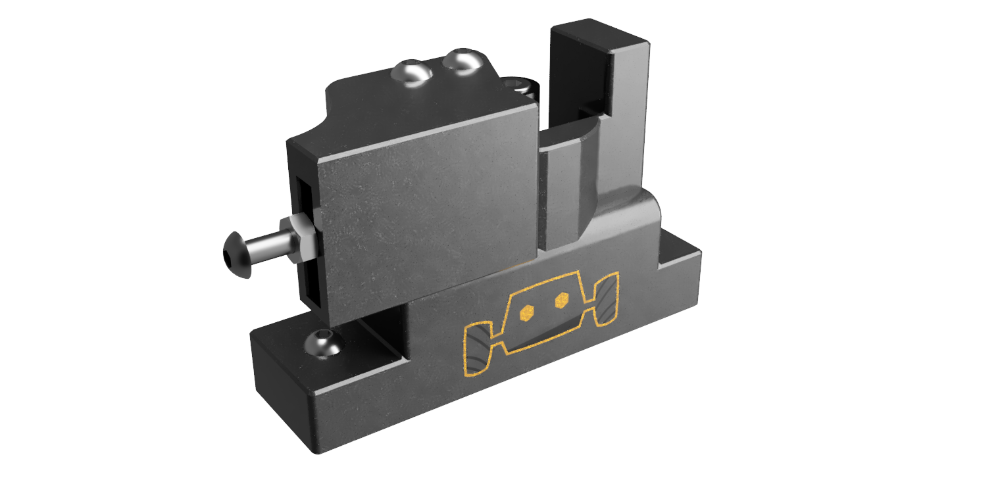
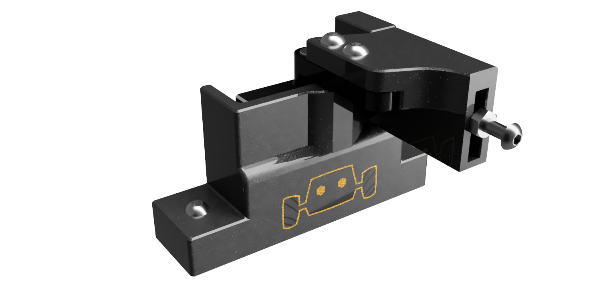

# FilametrixAxon

     

This project is a redesign of this [servo-actuated depressor](https://www.printables.com/model/1097275-voron-24r2-filametrix-filament-cutter-gantry-servo). We found that the SG90/MG90 servos break easily from chamber heat, so we modified it to work with a better micro servo. 

|  |  |
| --- | --- |

# Bill of Materials

| Part | Quantity |
| --- | --- |
| Axon Micro | 1 |
| Axon B25T Servo horn | 1 |
| M2.5 6mm screw (any head type) for servo horn | 1 |
| M4 BHCS or SHCS 8mm screw | 2 |
| M3 BHCS or SHCS 16mm screw | 2 |
| M3 BHCS or SHCS 20mm+ screw | 1 |
| M3 Nut | 2 |
| M2 BHCS 8mm screw | 2 |

Alternatively, the AGFRC models A20CLS A20BHS, A20CLM and A20BHM can be used. 
